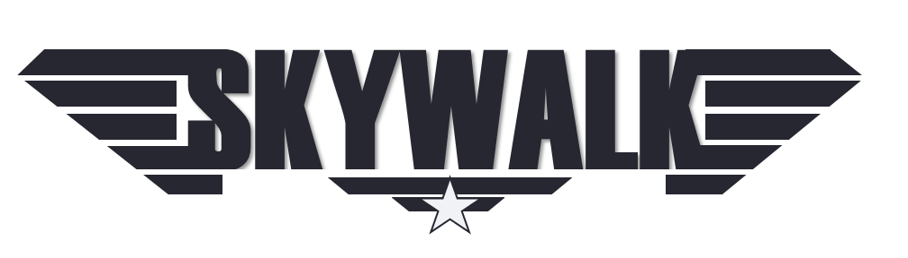

.. raw:: html

    

        <h1 style="font-size: 42px; margin-bottom: 10px;">
            Skywalk Aviation App
        </h1>
        

            Plan smarter, fly safer. The all-in-one tool for pilots to manage flight data, weight & balance, and checklists.
        

        

            <a href="subscription.html" style="
                background-color:#2A3F54;
                color:white;
                padding:14px 28px;
                border-radius:8px;
                text-decoration:none;
                font-size:18px;
                margin-right:10px;">
                Start Free Trial
            </a>
            <a href="features.html" style="
                border:1px solid #2A3F54;
                color:#2A3F54;
                padding:14px 28px;
                border-radius:8px;
                text-decoration:none;
                font-size:18px;">
                Demo
            </a>
        

    

.. toctree::
    :hidden:

    features
    mainscreen
    subscription

.. include:: add_bottom.add
